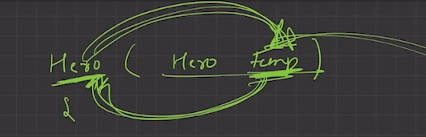
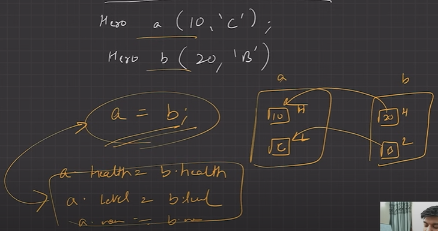

---
### COPY CONSTRUCTOR
```c++
// copy constructor
className ( className &Object ){
 ....
}

//calling
className Object1(Object2)
//OR
className Object1 = Object2
```
we use `&` bcoz, if not it will pass by value, will create a copy, again will call copy constructor and will stuck in an infinite loop.


---

### <center> SHALLOW VS DEEP COPY

Shallow Copy  
Creating object from other via copy constructor, points to same address hence changing one affects other

---
### <center> COPY ASSIGNMENT OPERATOR

