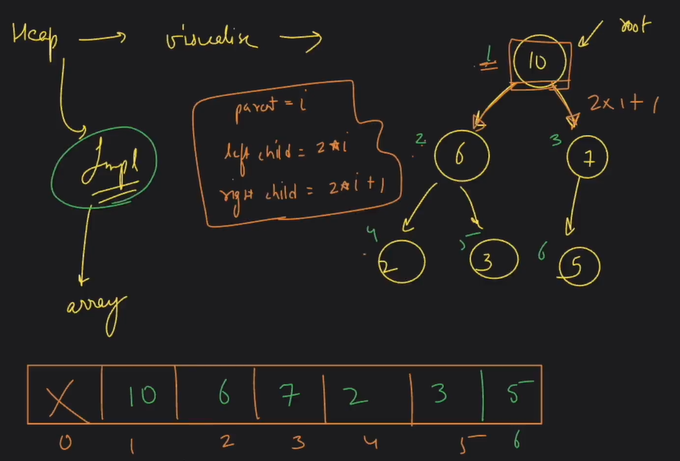

# Lecture 1
### What is Heap ?
Complete Binary Tree + Satisfies heap property.

**COMPLETE BT?**  
All levels are completely filled, except last node.  
Nodes are filled from left to right.

**HEAP PROPERTY?**  
1. **Min Heap Property** : Left > Parent, Parent < Right  
2. **Max Heap Property** : Left < Parent, Parent > Right  
In terms of value

---

### Implementation ?  
Heaps are visualised using Trees &  
Implemented using Array, with 1 based indexing

           Parent = i
    Left = 2*i  Right = 2*i+1