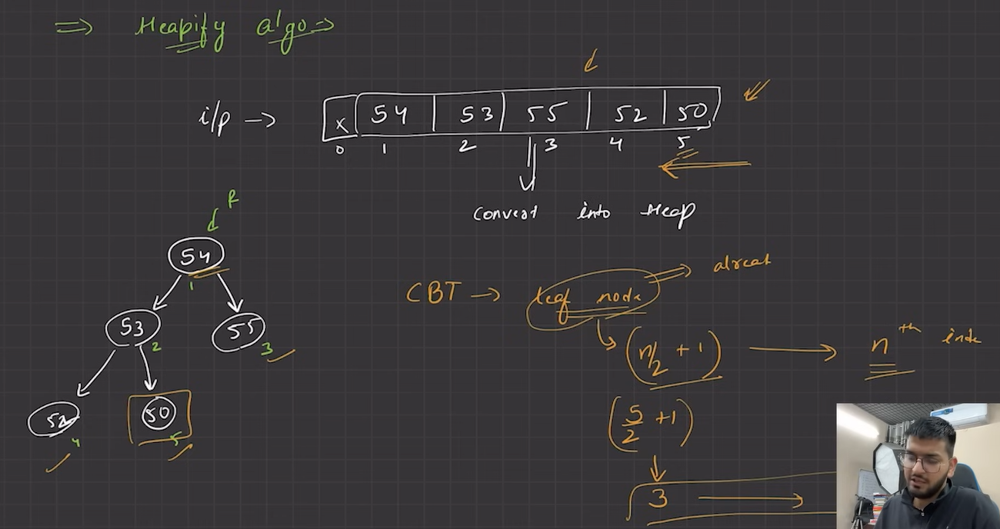

# HEAPS

**WHAT ?**  
CBT + Follows Heap Order property

---
**COMPLETE BINARY TREE ?**  
Every Level filled apart from last  
Nodes get filled from left

**HEAP ORDER PROPERTY ?**  
**1. Max Heap** : Child node < Parent Node   
**2. Min Heap** : Child node > Parent Node

---
  

If node -> `i`th index,  
Left Child -> `2*i`th index  
Right Child -> `2*i + 1` th index

---
### INSERTION -  
Ques : Insert 55 in the tree
1. Insert at the end  
 
2. Compare with parent, by finding parent index at `i/2` and swap accordingly  

---
[Creation on Heaps and Basic Operations](/18%20Heaps/1_CreatingHeap.c++)

### DELETION

---

# 
 HEAPIFY ALGORITHM

Sends node to its correct position