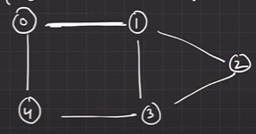

# GRAPHS
Collection of nodes & edges.  
Tree was hierarchial, here we have nodes as neighbours

Nodes ? To store an entity.  
Edges ? To make connection b/w edges.

**DEGREE ?**  
No of edges connected to a node  
In Directed graph we have  
INDEGREE : Edges coming towards node  
OUTDEGREE : Edges going out

**PATH ?**
To reach a node from one node

---
## Types of Graphs
#### Based on Edges
1. Unidirectional : One Direction
2. Undirectional : No Direction
3. Bidirection : Both Way

#### Based on Weights
1. Weighted : Have weights (price, cost, distance etc.)
2. Non Weighted : Doesn't have weights

#### Based on Connection
1. Connectionless : Nodes can be disjoint
2. Connected

#### Based on cycle
1. Cyclic : If we can reach the node from where we started
2. Acyclic : If boken link or direction in such a way that we can't reach starting node

---
Graphs can be created using 
- Adjacency List,
- Adjacency Matrix,
- Edge List
- 2d Matrix

We have to store Nodes, & edges connecting them.

---
## Graph using Adjacency Matrix
 

---
## Graph using Adjacency List
List in c++ ?  
Same as doubly linked list

Operations -
push_front(), push_back(), pop_front(), pop_back(), front(), back(), size()

 

Hence can be formed using  `map < int, list<int> >`

---
# 
 BFS
Breadth first search  
Make sure u dont stuck in loop  

